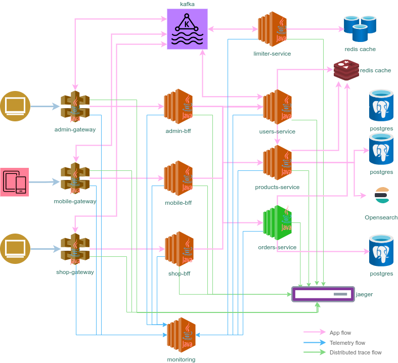
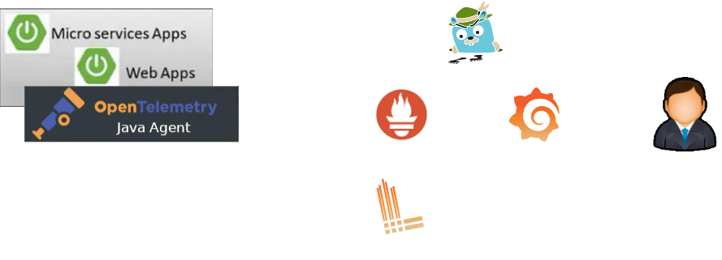

# Orders service #

[](https://github.com/sjexpos/ecomm-orders-service/releases/latest)
[](https://github.com/sjexpos/ecomm-orders-service/actions?workflow=CI)
[](https://codecov.io/gh/sjexpos/ecomm-orders-service)
[](https://github.com/sjexpos/ecomm-orders-service/issues)
[](https://github.com/sjexpos/ecomm-orders-service/commits/)

[](https://hub.docker.com/r/sjexposecomm/orders-service)
[](https://hub.docker.com/r/sjexposecomm/orders-service/tags)



This microservice is responsible for ...

## Modules structure ##

This project has a hexagonal architecture and the modules are:

* **api** - interfaces which are implemented as controllers on **rest-api**
* **db-scripts** - flyway database scripts
* **domain** - domain objects
* **application** - use cases
* **infrastructure**
   * **rest-api** - controllers which implement interfaces on **api**
   * **persistence** - all classes and functionality related to how domain object are stored.
   * **spring-boot** - all classes and configuration related to IoC container (spring boot)
* **sdk** - classes which implement interfaces on module **api** to call services of this microservice remotely.
* **uploads-detector** - AWS lambda function which is triggered when a file is uploaded to S3 using URL signed, and it invokes an user service endpoint to notify this.

## Framework

* [Spring Boot 3.3.2](https://spring.io/projects/spring-boot/)
* [Spring Cloud 2023.0.3](https://spring.io/projects/spring-cloud)
* [Spring Data 3.3.2](https://spring.io/projects/spring-data)
* [Openapi V3](https://swagger.io/specification/)
* [Hibernate 6.6](https://hibernate.org/orm/)
* [Hibernate Search 7.2.0](https://hibernate.org/search/)

## Observability

This project implements observability using OpenTelemetry agent
* traces: they are exported by the agent using [OpenTelemetry](https://opentelemetry.io) protocol (otlp on grpc). The receiver of the information is [Jaeger](https://www.jaegertracing.io/). In kubernetes, jaeger collector is used.
* metrics: they are exposed by the agent in a new port and endpoint to be scrapped by prometheus. 
* logs: they are sent to console. In kubernetes, Loki pulls logs from pods.


  
OpenTelemetry collector receives oltp data and sends them to different exporters according to their type (metrics, traces, logs). Metrics are exposed to be pulled by prometheus. Traces are sent to Jaeger. And logs are sent to Loki.

## Requirements

* [Java 21](https://openjdk.org/install/)
* [Maven 3.8.8+](https://maven.apache.org/download.cgi)
* [AWS Cli](https://aws.amazon.com/es/cli/)
* [Docker](https://www.docker.com/)

## Build

```bash
mvn clean && mvn install
```

## Run Tests
```bash
mvn clean && mvn tests
```

## Runtime requeriments

* **Postgres Database** - it must be run on port 5432. It must exist a schema named `ecomm_orders` and schema owner must be `orders_service`/`1234`.
* **Redis** - it must be run on port 6379. None password.
* **Opensearch** - it must be run on port 9200. None password.

### Start volatile storage locally

```bash
cd infrastructure/spring-boot
mvn -Dtests.db.database=ecomm_orders pre-integration-test
```

### Run application
```
./run.sh
```

### Debug application on port 5005
```
./debug.sh
```

## Swagger UI

http://localhost:6063/


## Run application from IDE

This application uses S3Client from AWS SDK v2 because it needs to reach S3 and get a signed upload URL when a user wants to upload an avatar. So when it run locally and AWS credentials are not available, it's possible connect to localstack which is running as part as `local volatile storage`.

For that, the following environment variables must be defined in the IDE launcher
```
AWS_REGION=us-east-1
AWS_DEFAULT_REGION=us-east-1
AWS_ACCESS_KEY_ID=test
AWS_SECRET_ACCESS_KEY=test
AWS_ENDPOINT=http://localhost:4566
```
